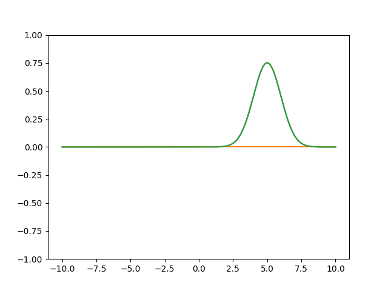

# Quantum Harmonic Oscillator

The quantum harmonic oscillator is the system given by the Hamiltonian 
$H = -\frac{1}{2}\Delta + \frac{1}{2}X^2$ where $X$ is the position operator. We 
can instantiate this Hamiltonian in qmax as follows.

```python
import jax.numpy as jnp
import qmax as qx

hilbert_space = qx.spaces.FiniteDifference(x0=-10, x1=10, num_steps=500)
L = hilbert_space.laplacian()
V = hilbert_space.potential_energy(lambda x: 0.5 * x ** 2)
H = -0.5 * L + V
```

The time-independent Schrodinger equation is $H\psi = E\psi$. qmax supplies 
eigensolvers to 

```python
eigvals, eigvecs, residuals = qx.eig.op_eigh(H)
plt.plot(hilbert_space.x_range, jnp.real(eigvecs[15].values))
plt.show()
```

The time-dependent Schrodinger equation is $i\hbar \dot{\psi} = H\psi$.  The *propagator* 
is a family of unitary operators $U(t_0, t)$ where 
$$
i\hbar\frac{dU(t_0, t)}{dt} = HU(t_0, t)
$$
The solution to the Schrodinger equation is $\psi(t_0)$ is $\psi(t) = U(t_0, t)\psi(t_0)$. 

```python
U = qx.Propagator(H, t0=0.0, t1=4 * jnp.pi, num_steps=1200)
y0 = hilbert_space.from_function(lambda x: jnp.exp(-0.5 * (x - 5) ** 2))
y0 = y0 / y0.norm()

result = U.propagate(y0, save_every=6, progressbar=True)
```

```python
import matplotlib.pyplot as plt
import matplotlib.animation as animation
from IPython.display import Image
fig, ax = plt.subplots()

line_real = ax.plot(hilbert_space.x_range, jnp.real(y0.values))[0]
line_imag = ax.plot(hilbert_space.x_range, jnp.imag(y0.values))[0]
line_abs = ax.plot(hilbert_space.x_range, jnp.abs(y0.values))[0]
ax.set_ylim([-1, 1])W

def update(frame):
    y = result.ys[frame]
    line_real.set_ydata(jnp.real(y.values))
    line_imag.set_ydata(jnp.imag(y.values))
    line_abs.set_ydata(jnp.abs(y.values))
    return (line_real, line_imag, line_abs)

ani = animation.FuncAnimation(fig=fig, func=update, frames=200, interval=30)
ani.save("qho.gif")
```

